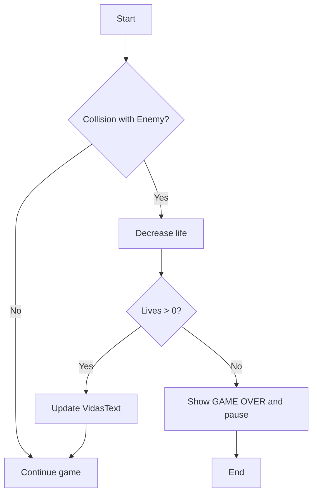
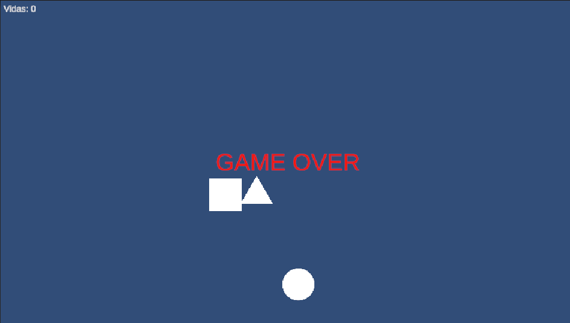

# Collisions

## 🎯 Objetivo
Documentar el sistema de colisiones entre `Player` y `Enemy`, el manejo de vidas y la pantalla de **Game Over**.

---

## ✅ Criterios de aceptación
- [X] El Player pierde 1 vida al colisionar con Enemy.
- [X] Las vidas restantes se muestran en pantalla (TextMeshPro).
- [X] Si las vidas llegan a 0, aparece el mensaje **GAME OVER** y el juego se pausa.
- [X] La implementación queda documentada y el Issue #4 se cierra con el PR.

---

## 🔹 Descripción general
El `Player` mantiene un contador de vidas (`vidas`). Al colisionar contra un objeto con tag `Enemy`, se ejecuta la lógica `PerderVida()` que decrementa el contador, actualiza la UI y, si `vidas <= 0`, muestra `GAME OVER` y pausa la ejecución (`Time.timeScale = 0`).

---

## 🔹 Detección de colisión (resumen)
Usamos `OnCollisionEnter2D` para detectar colisiones físicas entre colliders 2D:

```csharp
private void OnCollisionEnter2D(Collision2D collision)
{
    if (collision.gameObject.CompareTag("Enemy"))
    {
        PerderVida();
    }
}
```
### Asegurarse de que:

- Player tenga Rigidbody2D (Dynamic) y Collider2D.

- Enemy tenga Collider2D y el Tag = "Enemy".

---

## 🔹 Código Principal: PlayerHealth.cs
Usamos `OnCollisionEnter2D` para detectar colisiones físicas entre colliders 2D:

```csharp
using UnityEngine;
using TMPro;

public class PlayerHealth : MonoBehaviour
{
    public int vidas = 3;
    public TMP_Text vidasText;
    public TMP_Text gameOverText;

    private void Start()
    {
        ActualizarUI();
        gameOverText.text = "";
    }

    private void OnCollisionEnter2D(Collision2D collision)
    {
        if (collision.gameObject.CompareTag("Enemy"))
        {
            PerderVida();
        }
    }

    void PerderVida()
    {
        vidas--;
        ActualizarUI();

        if (vidas <= 0)
        {
            GameOver();
        }
    }

    void ActualizarUI()
    {
        vidasText.text = "Vidas: " + vidas;
    }

    void GameOver()
    {
        gameOverText.text = "GAME OVER";
        Time.timeScale = 0f;
    }
}

```
---
## 🔹 UI (TextMeshPro)
- VidasText: TMP Text en la esquina superior izquierda (ej. Vidas: 3).
- GameOverText: TMP Text centrado, Auto Size ON (Min 20 / Max 150), Alignment Middle Center, Horizontal & Vertical Overflow = Overflow.
- Recomendación: usar Canvas Screen Space - Overlay y Canvas Scaler → Scale With Screen Size (Reference 1920x1080).

---
## 🔹 Diagrama de flujo

---
## Captura de pantalla


---
