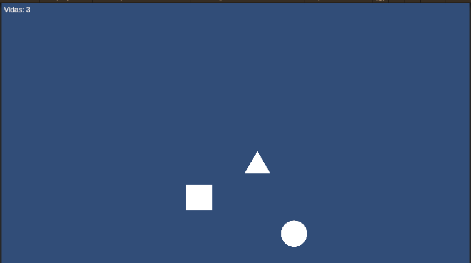

# EnemyFollowPlayer

## 🎯 Objetivo
Hacer que el Enemy siga al Player dinámicamente en 2D.

---

## 🔹 Descripción
El Enemy obtiene la posición del Player y se mueve hacia él usando `Vector3.MoveTowards`.

---

## 🔹 Código principal

```csharp
using System;
using UnityEngine;

/// <summary>
/// Script that controls an enemy's movement to follow the player.
/// </summary>
public class EnemyFollowPlayer : MonoBehaviour
{
    
    #region Variables
    /// <summary>
    /// Represents the player's transformation.
    /// </summary>
    [SerializeField] private Transform player;
    /// <summary>
    /// Movement speed in units per second.
    /// </summary>
    [SerializeField] private float speed = 2f;
    /// <summary>
    /// Represents the space range the enemy has to detect the player.
    /// </summary>
    [SerializeField] private float detectionRange = 5f;

    
    #endregion

    #region Unity Lifecycle

    /// <summary>
    /// Initializes the patrol objective at the start 
    /// of the scene.
    /// </summary>
    void Update()
    {

        //Calculates distance between the player and the enemy
        float distance = Vector2.Distance(transform.position, player.position);

        if (distance < detectionRange)
        {
            // Follow the player
            transform.position = Vector2.MoveTowards(
                transform.position,
                player.position,
                speed * Time.deltaTime
            );
        }
    }
    #endregion
}
```

---

## 🔹 Notas técnicas
- `player` debe ser asignado en el Inspector (arrastrando el objeto Player).  
- Velocidad ajustable desde el Inspector.  
- Ideal para IA básica de persecución.  

---

## 📸 Captura de pantalla
Captura mostrando al Enemy siguiendo al Player en la escena.

