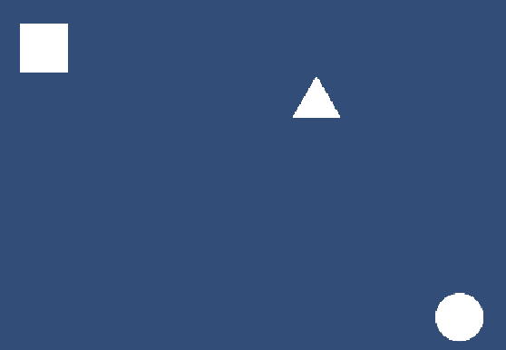

# EnemyPatrol

## 🎯 Objetivo
Implementar un sistema de patrullaje para que el Enemy se desplace entre dos puntos.

---

## 🔹 Descripción
El Enemy se mueve entre `pointA` y `pointB` usando `Vector3.MoveTowards`.  
Cuando llega a uno de los puntos, cambia su objetivo al otro.

---

## 🔹 Código principal

```csharp
using UnityEngine;

/// <summary>
/// Script that controls an enemy's movement between two patrol points.
/// Can be used on basic enemies that patrol from left to right.
/// </summary>
public class EnemyPatrol : MonoBehaviour
{
    #region Variables

    /// <summary>
    /// Starting point of the patrol.
    /// </summary>
    [SerializeField] private Transform pointA;
    /// <summary>
    /// End point of the patrol.
    /// </summary>
    [SerializeField] private Transform pointB;
    /// <summary>
    /// Movement speed in units per second.
    /// </summary>
    [SerializeField] private float speed = 2f;
    
    //Current target the enemy is moving towards
    private Vector3 target;
    #endregion

    #region Unity Lifecycle
    /// <summary>
    /// Initializes the patrol objective at the start 
    /// of the scene.
    /// </summary>
    void Start()
    {
        target = pointB.position;
    }

    /// <summary>
    /// Updates enemy movement every frame.
    /// </summary>
    void Update()
    {
        // Move towards the target point
        transform.position = Vector2.MoveTowards(transform.position, 
                                target, speed * Time.deltaTime);

        // Change target if arrived
        if (Vector2.Distance(transform.position, target) < 0.1f)
        {
            target = (target == pointA.position) ? 
                                pointB.position : pointA.position;
        }
    }
    #endregion
}
```

---

## 🔹 Notas técnicas
- `pointA` y `pointB` se arrastran desde la escena al Inspector.  
- `speed` controla la velocidad de patrullaje.
- `target` expresa el vector objetivo.  

---

## 📸 Captura de pantalla

