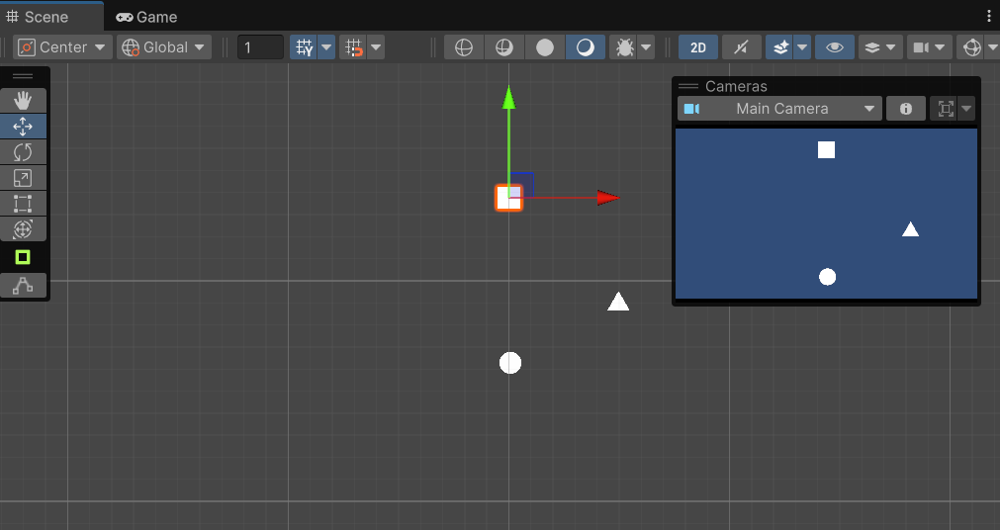

# PlayerMovement

## 🎯 Objetivo
Controlar el movimiento del jugador en un entorno 2D usando entradas de teclado.

---

## 🔹 Descripción
El script `PlayerMovement.cs` permite mover al Player en los ejes **horizontal y vertical**.  
Se utilizan las funciones de Unity `Input.GetAxisRaw` para obtener el input de teclado.

---

## 🔹 Código principal

```csharp
using UnityEngine;

[RequireComponent(typeof(Rigidbody2D))]
public class PlayerMovement : MonoBehaviour
{
    public float speed = 5f;
    private Rigidbody2D rb;
    private Vector2 moveInput;

    void Start()
    {
        rb = GetComponent<Rigidbody2D>();
        rb.gravityScale = 0f;
        rb.constraints = RigidbodyConstraints2D.FreezeRotation;
    }

    void Update()
    {
        moveInput.x = Input.GetAxisRaw("Horizontal");
        moveInput.y = Input.GetAxisRaw("Vertical");
    }

    void FixedUpdate()
    {
        rb.MovePosition(rb.position + moveInput * speed * Time.fixedDeltaTime);
    }
}
```

---

## 🔹 Notas técnicas
- Requiere `Rigidbody2D` en el Player.  
- Se recomienda usar `FixedUpdate` para movimiento físico.  
- `speed` se ajusta en el Inspector.  

---

## 📸 Captura de pantalla
Captura del Player en la escena, mostrando la cuadrícula o el entorno donde se mueve.

